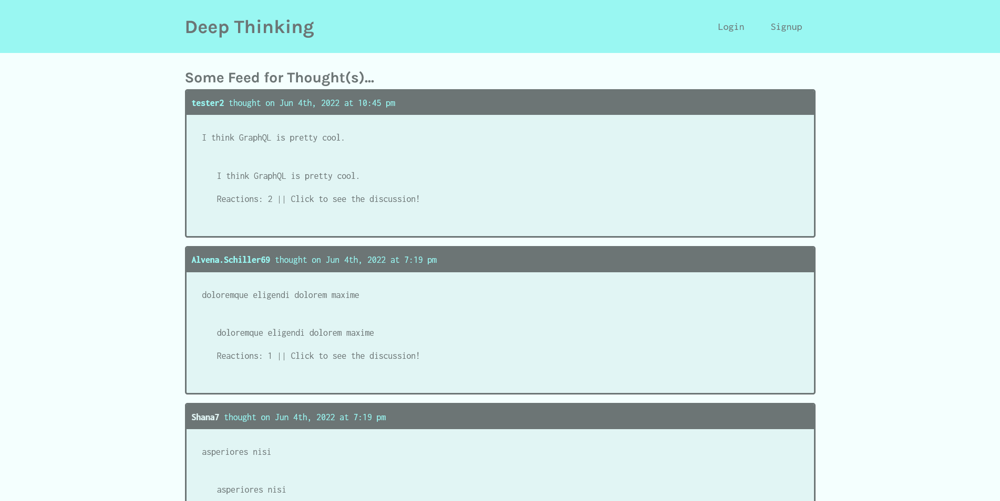

# Deep Thinking

## Description
Deep Thinking is a website that allows users to create accounts and then post thoughts they have that can be seen by other users. Users can post reactions to thoughts and also view profiles of other users and see all their thoughts. Built with MongoDB, Express.js, React.js, Node.js, and GraphQL.

## Deployed Site
You can visit this site here: https://deep-thinking1.herokuapp.com/ 

## Screenshot

## Questions
If you have questions, you can email me at samclark2399@gmail.com or you can checkout my repos
on my <a href=https://github.com/sam-clark1>GitHub</a>.